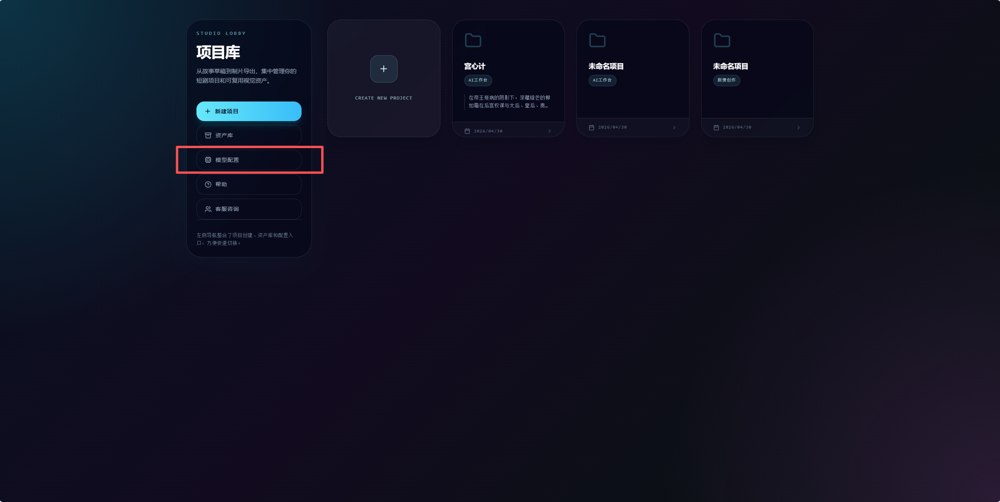
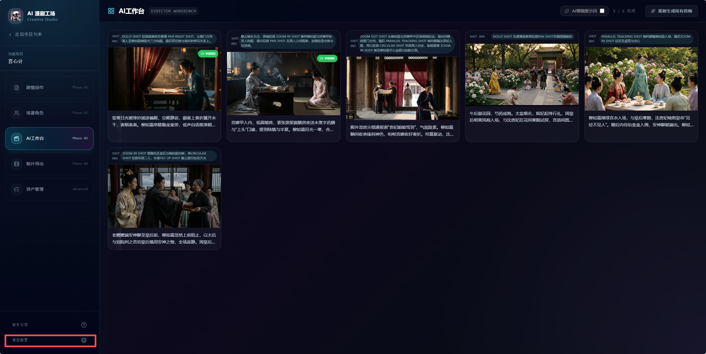
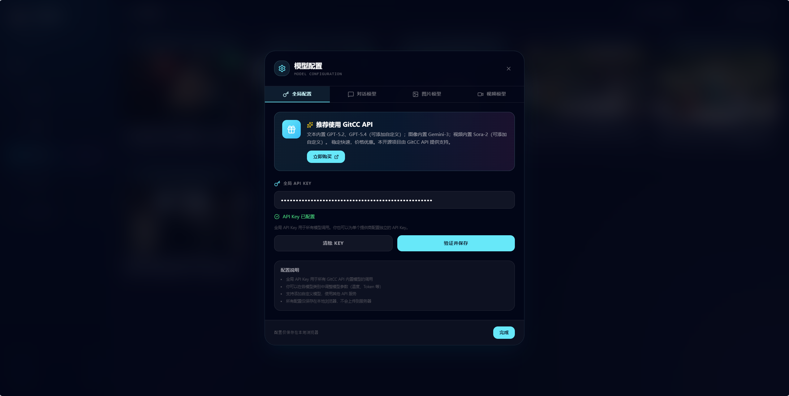
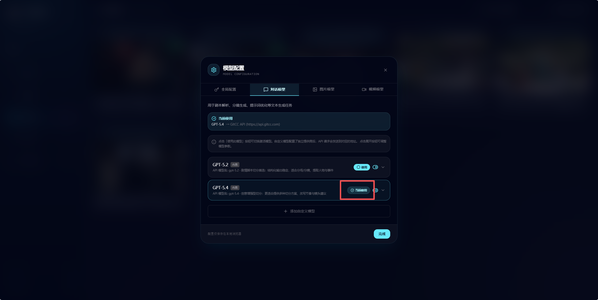
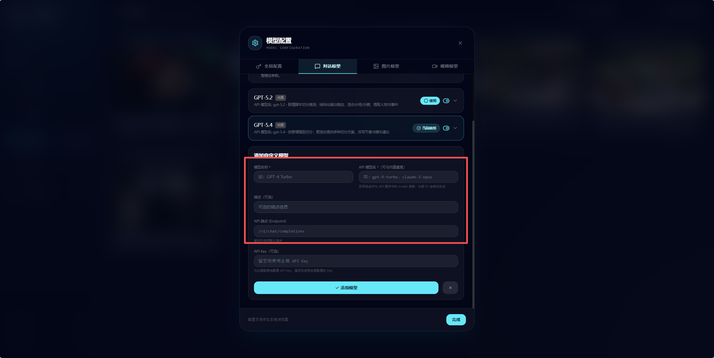
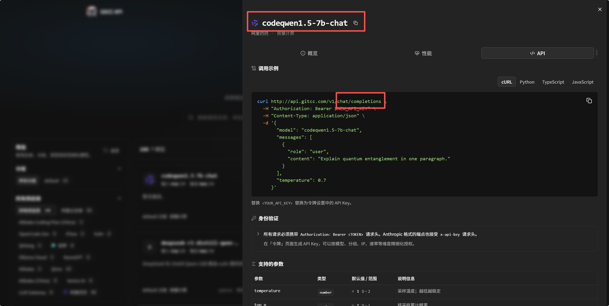
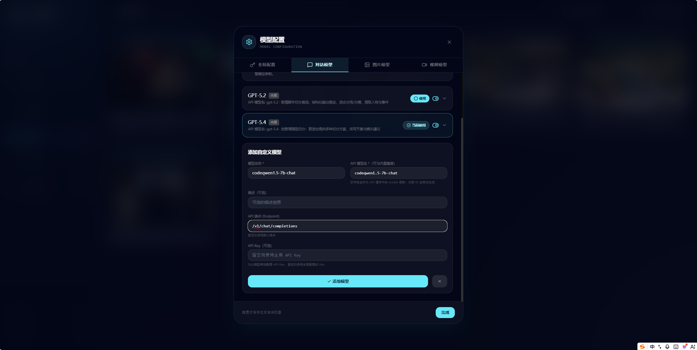
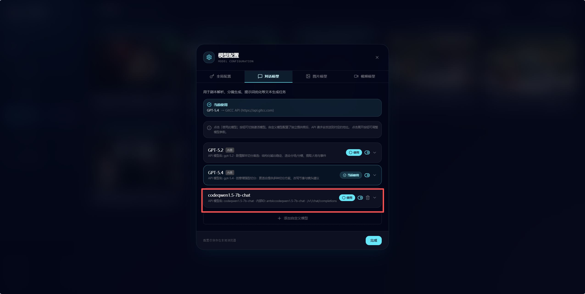

# AI 漫剧工场 · 模型配置指南

本文说明如何在 **AI 漫剧工场** 中配置 GitCC API Key、切换内置模型，以及添加自定义对话 / 图片 / 视频模型。

> **说明**：所有模型配置保存在**当前浏览器的本地存储**中，换电脑或清理站点数据后需重新配置。  
> API 请求默认发往 `https://api.gitcc.com`（本地开发 / Docker / 桌面端会通过 `/api-proxy` 代理，无需在浏览器里直连外域）。

---

## 目录

1. [内置模型一览](#内置模型一览)
2. [打开「模型配置」](#打开模型配置)
3. [全局配置：API Key](#全局配置api-key)
4. [对话模型](#对话模型)
5. [图片模型](#图片模型)
6. [视频模型](#视频模型)
7. [添加自定义模型](#添加自定义模型)
8. [在创作流程中选择模型](#在创作流程中选择模型)
9. [常见问题](#常见问题)

---

## 内置模型一览

| 类型 | 内置模型 | 默认激活 | 用途 |
|------|----------|----------|------|
| 对话 | GPT-5.2、GPT-5.4 | GPT-5.2 | 剧本解析、分镜生成、续写 / 改写、提示词优化 |
| 图片 | Qwen Image 2.0 | Qwen Image 2.0 | 角色定妆、场景图、关键帧 |
| 视频 | 豆包 Seedance 2.0 Fast、Sora-2 | 豆包 Seedance 2.0 Fast | 镜头视频片段（异步任务 + 轮询） |

- 内置列表**仅包含上表模型**；旧版内置（如 GPT-5.1、Veo 等）在刷新后会自动迁移到当前默认项。
- 仍可通过「添加自定义模型」接入平台支持的其它模型名称与接口（见下文）。

---

## 打开「模型配置」

可从以下入口打开 **模型配置** 弹窗：

| 入口 | 位置 |
|------|------|
| 项目列表页 | 顶部工具栏 **「模型配置」** 按钮 |
| 项目内 | 左侧边栏底部 **「模型配置」** |
| 首次使用 | 新手引导中的 API Key 步骤（完成后也可随时从上述入口修改） |

### 截图 1：项目列表页入口

---

### 截图 2：项目内侧边栏入口

---

### 截图 3：模型配置弹窗总览

---

## 全局配置：API Key

1. 打开 **模型配置** → 选择 **「全局配置」** Tab。  
2. 在 **全局 API Key** 输入框中粘贴从 [GitCC API](https://api.gitcc.com) 获取的 Key。  
3. 点击 **「验证并保存」**，看到成功提示后即可调用 AI。  
4. 需要更换 Key 时，可点击 **「清除」** 后重新填写。

未配置或验证失败时，剧本解析、出图、出视频等操作会提示 API Key 缺失。

### 截图 4：全局 API Key 配置

---

## 对话模型

**路径**：模型配置 → **「对话模型」** Tab。

### 能做什么

- 切换当前使用的文本模型（内置 **GPT-5.2** / **GPT-5.4**）。
- 启用 / 禁用某个模型（禁用后不会出现在下拉列表中）。
- 展开模型卡片调整 **温度**、**最大 Token** 等参数。
- 为单个模型单独填写 API Key（留空则使用全局 Key）。

### 操作步骤

1. 在列表中找到目标模型。  
2. 点击 **「使用此模型」** 设为当前激活（卡片上会显示「当前使用」）。  
3. 需要调参时，点击卡片右侧展开，修改后自动保存。  
4. 内置模型**不可删除**；自定义模型可删除。

### 截图 5：模型列表与激活

---

## 添加自定义模型

在 **对话模型 / 图片模型 / 视频模型** 任一 Tab 底部，点击 **「添加自定义模型」**。

### 必填项

| 字段 | 说明 |
|------|------|
| **模型名称** | 在界面中显示的名称，自定即可 |
| **API 模型名** | 请求体里的 `model` 参数，须与 GitCC / 上游文档一致 |

### 选填项

| 字段 | 说明 |
|------|------|
| **描述** | 备注，方便区分多个自定义模型 |
| **API 端点 (Endpoint)** | 留空则用类型默认路径（对话 `/v1/chat/completions`，图片见占位提示，视频 `/v1/videos`） |
| **API Key** | 仅该模型使用；留空则用全局 Key |

### 视频模型额外项

添加视频模型时需选择 **API 模式**（同步 / 异步 / Doubao），保存后可在卡片中继续改比例、时长等参数。

### 截图 9：添加自定义模型表单

---

### 截图 10：自定义模型保存后在列表中

---

